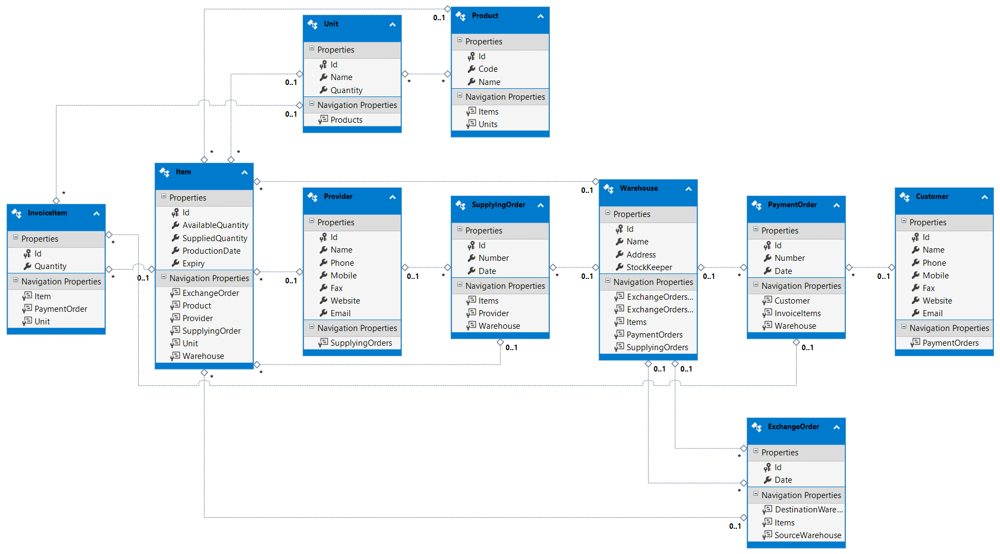

# warehouse manager

## Linq & EF Project with C#, windows forms and Microsoft SQL server

### features
- manage Warehouse
- manage Product
- manage Providers
- manage Customers
- manage Supplying Orders
- manage payment Orders
- keep tracking of Products movement between Warehouses
- Reports
- English/Arabic interface

### Installation tools
- SQL Server 2014
- Visual Studio 2019

### ERD

